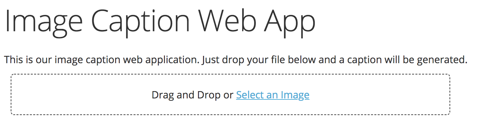
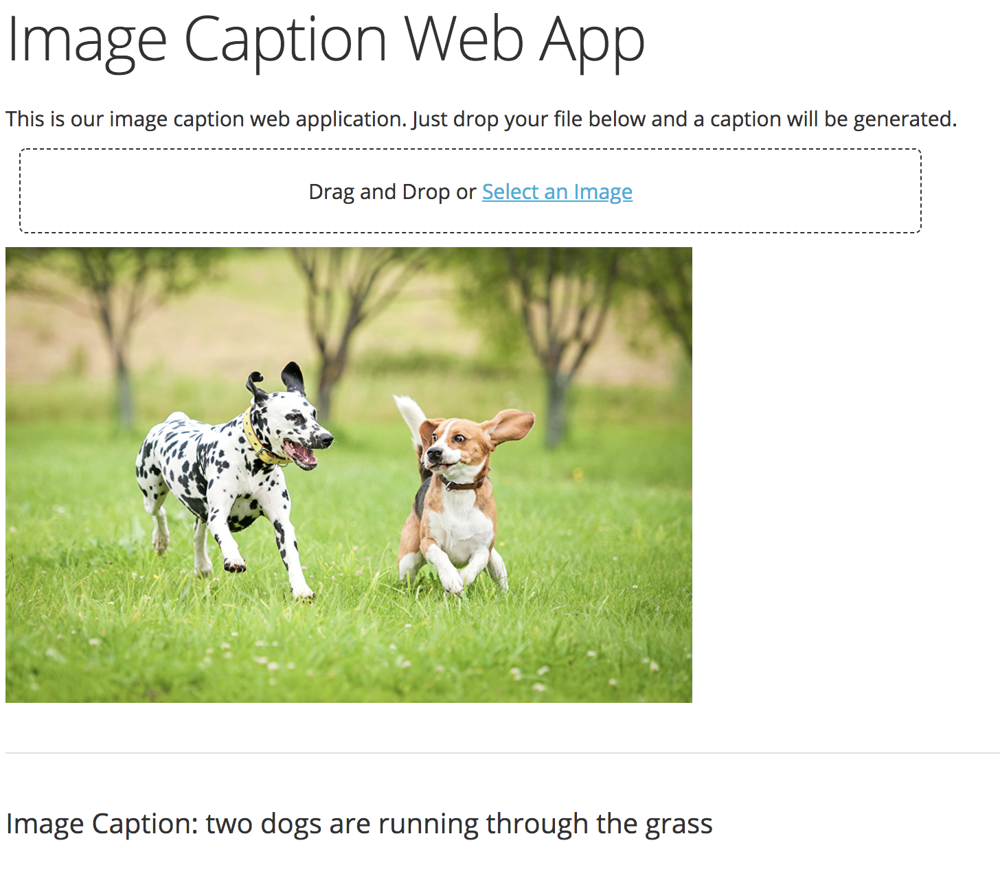

# ImageCaptionApp
Based on [1][2] I developed an image caption generator web app build with the dash framework in python. Just drag and drop or select a picture and the Web App takes care of the rest. 
For a more complete documentation of our model architecture feel free to visit our [blog post](https://humboldt- wi.github.io/blog/research/seminar/07imagecaptioning/).

---

---

---
Instructions:

---
Sources:  
[1] Jason Brownlee. How to Develop a Deep Learning Photo Caption Generator from Scratch, November 2017.
[2] Marc Tanti, Albert Gatt, and Kenneth P. Camilleri. Where to put the Image in an Image Caption Generator. arXiv preprint arXiv:1703.09137, 2017.
